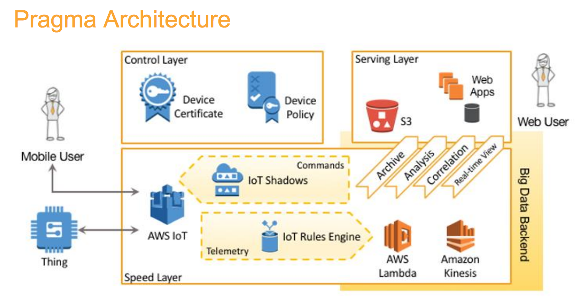

## Core Tenets of IoT

https://d0.awsstatic.com/whitepapers/core-tenets-of-iot1.pdf

| Meta         | Data       |
|--------------|------------|
| Type         | Whitepaper |
| Format       | PDF        |
| Last Updated | July, 2017 |

### Overview

* Core tenets are agility, scale, cost, and security

* **Agility** – The freedom to quickly analyze, execute, and build business
and technical initiatives in an unfettered fashion
  * In order for a company’s
IoT strategy to be a competitive advantage, the IT organization relies on having
a broad set of tools that promote interoperability throughout the IoT solution
and among a heterogeneous mix of devices.
* **Scale** – Seamlessly expand infrastructure regionally or globally to meet
operational demands
  * IoT solutions should be deployed in multiple physical locations to
meet the business objectives of a global enterprise solution such as data
compliance, data sovereignty, and lower communication latency for better
responsiveness from devices in the field
* **Cost** – Understand and control the costs of operating an IoT platform
  * By leveraging a flexible, consumption based pricing model,
the cost of an IoT solution and the related infrastructure can be directly
accessed alongside the business value delivered by ingesting, processing,
storing, and analyzing the telemetry received by that same IoT solution.
* **Security** – Secure communication from device through cloud while
maintaining compliance and iterating rapidly
  * In the Internet of Things, the attack surface is different than traditional web infrastructure. 
  * The pervasiveness of ubiquitous computing means that IoT vulnerabilities could lead to exploits that result in the loss of life, for example from a compromised control system for gasoline pipelines or power grids.

#### Device Gateway

* Responsible for maintaining the sessions and subscriptions
for all connected devices in an IoT solution. 
* Enables secure, bi-directional communication between connected devices and
the AWS platform over:
  * **MQTT** - industry standard - 
    * inherently encourages scalable, fault-tolerant communication patterns and fosters a wide range of communication options among devices and the Device Gateway
    * Device to device or broadcast pattern
    * Exposes different levels of Quality of Service (QoS) for more predictable delivery, acknowledgement, and retry logic
  * HTTP - another industry standard
  * WebSockets - also supported

**Rules Engine**
* Capable of filtering, transforming, and forwarding device messages as they are received by the Device Gateway
* SQL-based syntax

**Device Shadow**
* Maintains a virtual representation of the device
* Acts as a message channel to send commands to a device
* Stores last known state of device

**Device Registry**
* Fleet lifecycle management
* Holistic management view to control associations b/t things, shadows, permissions, and identities

#### Security

* **Data In Transit** - TLS
* **Identification / Authentication** - X.509 Certificates - must be provisioned, activated, and installed before it can be used as a valid entity with AWS IoT
* **IoT Policies** - IAM Users, Groups, Roles 

#### Event-Driven Services

* SQS
* SNS
* Lambda

#### Automation and DevOps
* Think CI/CD
* Can implement server-side and Device-side DevOps practices to automate operations
* CloudFormation
* [Introduction to DevOps on AWS](https://d0.awsstatic.com/whitepapers/AWS_DevOps.pdf)
* Firmware updates to connected devices - store the updates in S3 first
* Use a CDN (e.g. CloudFront) to distribute
* Use IoT Shadow to request devices pull an update

#### Administration and Security
* [AWS Shared Responsibility Model](https://aws.amazon.com/compliance/shared-responsibility-model/)
* CloudTrail - log API calls
* CloudWatch - for all AWS services in the system
* AWS IoT directly integrates with Amazon CloudWatch Logs - can read these as a stream for real-time anomaly / security threat detection

#### Pragma Architecture

* **Things** - The device and fleet of devices
* **Control Layer** - The control point for access to the Speed Layer and the
nexus for fleet management
* **Speed Layer** - The inbound, high-bandwidth device telemetry data bus
and the outbound device command bus
* **Serving Layer** - The access point for systems and humans to interact
with the devices in a fleet, to perform analysis, archive, and correlate
data, and to use real-time views of the fleet.
* Telemetry - processing of data emitted by devices

##### Scenario - Telemetry
1. Device authenticates
2. Device regularly sends data to Speed Layer
3. Rules Engine processes this data
4. Data sent to Kinesis or Lambda for use by Web users in Serving Layer

##### Scenario - Sending A Command To A Device
1. Users's app writes desired command to device's IoT Shadow
2. IoT Shadow and the Device Gateway work together to overcome an intermittent network to convey the command to the specific device

### Further Reading

* [AWS IoT Service](https://aws.amazon.com/iot/)
* [Getting Started with AWS IoT](https://aws.amazon.com/iot-platform/getting-started/)
* [AWS Case Studies](https://aws.amazon.com/solutions/case-studies/)
* [Big Data Analytics Options on AWS](https://d0.awsstatic.com/whitepapers/Big_Data_Analytics_Options_on_AWS.pdf)
