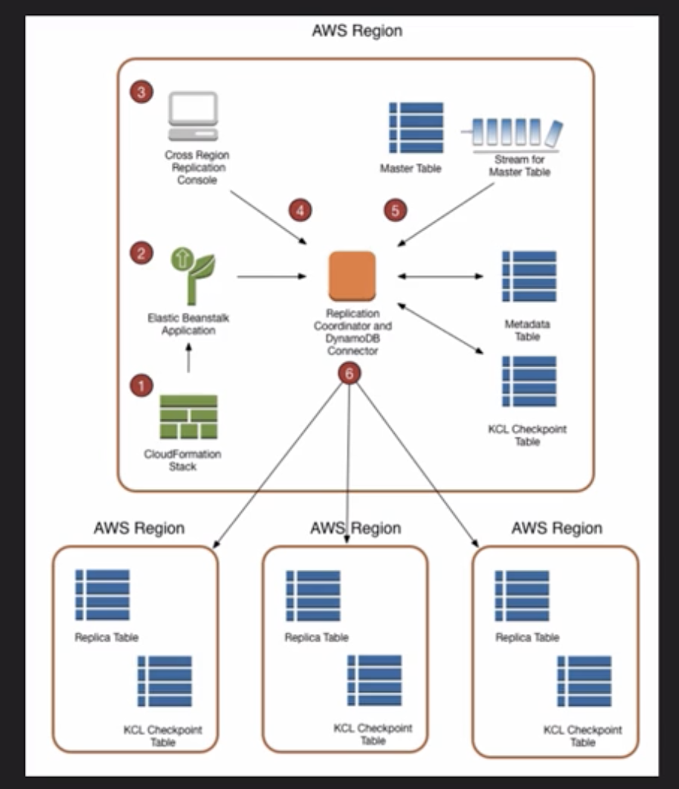

### DynamoDB Streams and Replication

#### Streams

* Ordered record of updates to a DynamoDB table

* Values stored for 24 hours

* Stream can be enabled from AWS console or API

* Can only be read or processed by Streams endpoint and API requests

* Stream endpoint is different than table endpoint, looks like this:

    * streams.dynamodb-<region_name>.amazonaws.com

* AWS guarantee each change to a DynamoDB table occurs in stream **only once**

* These changes occur in near-realtime

##### Example

* Start with a DynamoDB table, then add a stream
* When a record is inserted, for instance, only the partition key is inserted into the stream by default

* Changes recorded in streams have a "limitation" - you initially don’t know the nature of the operation on the partition key (don’t know specific details of what attributes changed, pre/post states of attribute values, etc.)

* To overcome this, streams can be configured with one of four "views"

    * **KEYS_ONLY** - only key attributes are written to the stream (doesn’t do much good)

    * **NEW_IMAGE** - entire item POST update written to the stream (after)

    * **OLD_IMAGE** - entire item PRE update written to the stream (before)

    * **NEW_AND_OLD_IMAGES** - pre and post operation state of the item is written to the stream, allowing more complex comparison operations to be performed ("allow a pre and post comparison without consulting DynamoDB")

#### Streams and Replication

##### Use Cases

1.  Replication

    * Disaster Recovery (DR) - database table in one AW region, replicating to another region for DR failure
        * Close to realtime, but there will be some latency
        * Latency depends on which regions are involved and what the latency is b/t regions

    * Large distributed applications with users worldwide - using a multi-master database model.  A synched set of tables operating worldwide.
    
2.  Triggers

    * Lambda function triggered when new record added to stream, do analytics on data
    
    * Lambda function triggered when new user signup on web app, data entered into users table, email sent to users, etc.

##### Example w/ CloudFormation and Elastic Beanstalk

1.  Create or select table to be replicated

1.  Apply cloud formation stack and wait - stack will shift to COMPLETE - look in output section of the stack to get URL for replication console

1.  Login to the replication console and create a replication group **identify** (?)

1.  Wait for process to be completed, in the background additional checkpoint tables will be created

* See this link from AWS for more info: [DynamoDB Cross-Region Replication](http://docs.aws.amazon.com/amazondynamodb/latest/developerguide/Streams.CrossRegionRepl.html)

* **Second Option** - With DynamoDB Streams and Lambda, you can create an event-driven architecture where streams are captured and invoked by Lambda functions so that the Lambda function you write can copy the data to a different region (no need for EC2 instance w/ Kinesis Client Library)

#### For the Exam

* Understand capability of DynamoDB Streams

* Understand use cases of DynamoDB Streams

* Know that Streams + Lambda allow traditional DB style triggers (lots of questions)

* Know the four "views" of streams:

    * **KEYS_ONLY** - only key attributes are written to the stream (doesn’t do much good)

    * **NEW_IMAGE** - entire item POST update written to the stream (after)

    * **OLD_IMAGE** - entire item PRE update written to the stream (before)

    * **NEW_AND_OLD_IMAGES** - pre and post operation state of the item is written to the stream, allowing more complex comparison operations to be performed

* Understand cross-region replication as a feature of DynamoDB Streams
