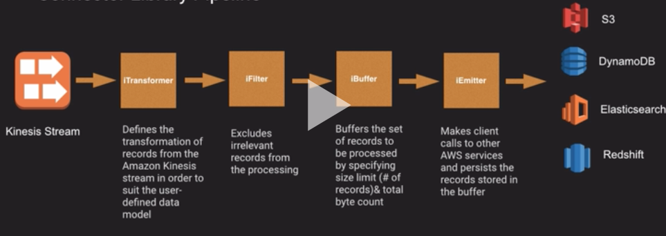

### Kinesis Streams Emitting Data to AWS 

* Consumers can emit data to EMR by writing to S3 first, there was an old connector for Hadoop 1.0 but it’s gone?

* Can use Spark Streaming to consume data from Kinesis Streams and then put data into one of the below as well

    * Spark Streaming has integration with Kinesis Streams through the Kinesis Connector Library

* Kinesis Streams needs to use the [Kinesis Connector Library](https://github.com/awslabs/amazon-kinesis-connectors) to emit data to:

    * S3

    * Elasticsearch

    * Redshift

    * DynamoDB
    
* For EMR, emit data to S3, then EMR can consume from there.
  * There *was* a connector on GitHub, but it was for Hadoop 1.0.  There doesn't seem to be a connector for Hadoop 2.
  * Can also use Spark Streaming to consume from Kinesis and then push data into S3, Redshift, DynamoDB

* Can create Lambda functions to automatically read batches of records off your Kinesis Stream, and process them, can then send to:

    * S3

    * DynamoDB

    * Redshift

#### Use Cases

* **S3** - archiving data

* **DynamoDB** - metrics in near real-time

* **Elasticsearch** - Search and index

* **Redshift** - Micro batch loading

* **EMR** - process and analyze data (e.g., with Spark Streaming)

* **Lambda** - automate emitting data to DynamoDB, S3 or Redshift

#### Kinesis Connector Library

* Java-based

* Used to build apps in conjunction with Kinesis Client Library

* Currently has connectors for:

    * S3

    * Elasticsearch

    * Redshift

    * DynamoDB

* [Kinesis Connector Library](https://github.com/awslabs/amazon-kinesis-connectors) repo on Github has samples folder for emitting to S3, DynamoDB, Elasticsearch, Redshift (basic and manifest)

##### Connector Library Pipeline

* Records are retrieved from the stream, then transformed according to a user-defined data model

* Then buffered for batch processing

* Then emitted to appropriate AWS service

* Start with Kinesis Stream, then go through four interfaces in library:

    * **iTransformer** - defines the transformation of records from the Amazon Kinesis stream in order to suit the user-defined data model

    * **iFilter** - excludes irrelevant records from processing

    * **iBuffer** - buffers set of records to be processed by specifying size limit (number of records) and total byte count

    * **iEmitter** - makes client calls to other AWS services and persists the records stored in the buffer
      * This is the interface that helps us emit records to S3, Redshift, DynamoDB, and Elasticsearch



##### Connector Library Pipeline - Interfaces and Classes

* E.g., S3 emitter class

    * Writes buffer contents into a single file in S3

    * Requires the configuration of an S3 bucket and endpoint

```javascript
public class S3Emitter implements IEmitter<byte[]> {

    private static final Log LOG = LogFactory.getLog(S3Emitter.class);
    
    protected final String s3Bucket;
    
    protected final String s3Endpoint;
    
    protected final AmazonS3Client s3client;
    
    public S3Emitter(KinesisConnectorConfiguration configuration)
    
    protected String getS3FileName(String firstSeq, String lastSeq)
    
    protected String getS3URI(String s3FileName)
    
    public List<byte[]> emit(final UnmodifiableBuffer<byte[]> buffer) throws IOException
    
    public void shutdown()
    
    public void fail(List<byte[]> records)

}
```


(**Demo**)

* For the exam - "as long as you have a basic understanding of the Kinesis Connector Library, and how data is emitted into a service like Redshift, then you should be able to answer the questions that cover this topic."

* .properties file for each connector - defaults left for demo but check this out

*  A DynamoDB table is created when you create applications with the Kinesis Client Library - unique to each app to track state

**For the exam, know:**

* Data can be emitted to S3, Elasticsearch, Redshift, DynamoDB from Kinesis Streams using the Kinesis Connector Library
    * There are some questions specifically about how to get data into Redshift
    
* Lambda functions can automatically read records from a Kinesis Stream, process them, and send the records to Redshift, S3, or DynamoDB
