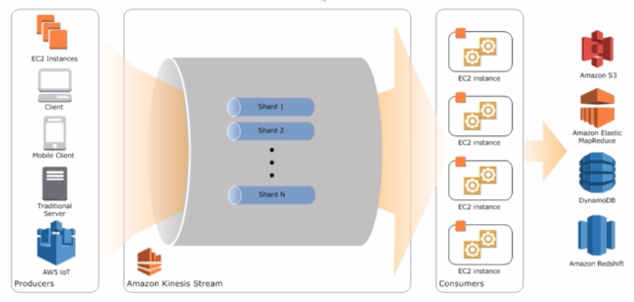

### Kinesis Streams Intro

* Three services in Kinesis, Streams, Firehose, and Analytics

* **Streams** - collect and process large streams of data in realtime

* **Firehose** - managed service, load data into Redshift, etc.

* **Analytics** - analyze large streams in realtime with SQL

Create a data processing applications, that reads data from stream as data records.  The process records can then be used to:

* Send to a dashboard

* Create alerts

* Dynamically change pricing

* Dynamically change advertising strategy

#### Common Scenarios

* Fast log and data feed processing (data logs, application logs, system logs, etc.) 

    * Faster than Cloudwatch (seconds, not minutes)

* Real-time metrics reporting

* Real-time data analytics - analyze how users are clicking around your site in realtime

    * Combine parallel processing with realtime data

* Complex stream processing - take data from one stream and put it into another

#### Benefits of Kinesis Streams

* Realtime aggregation of data

* Loading aggregate data into Redshift / EMR cluster

* Durability and elasticity - “you will never lose data records”

* Parallel application readers - multiple apps can read data from stream simultaneously and perform different functions

#### Loading Data Into / Getting Data From Streams

* **Producer** - anything that puts data into Kinesis Stream

    * Kinesis Producer Library (KPL) - simplifies creation of producer apps

* **Consumer** - anything that gets data from Kinesis Stream

    * Kinesis Client Library (KCL)

* **Kinesis Agent** - collect and send data to Kinesis Streams

* **Kinesis REST API** - put and get records to/from stream over HTTPS

* **Stream** - represents an ordered sequence of data records, records are distributed into **shards**

* Can emit to Lambda as well, though it’s not on this diagram:

