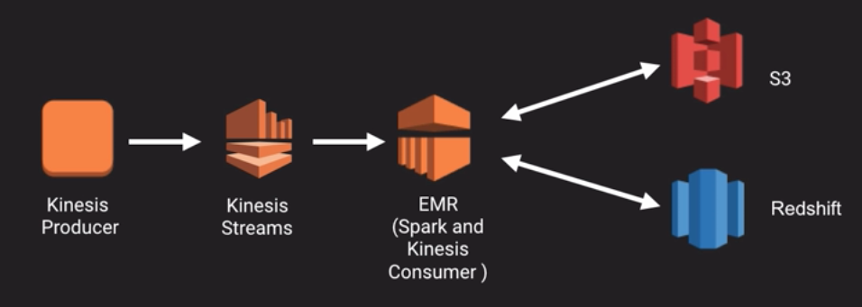
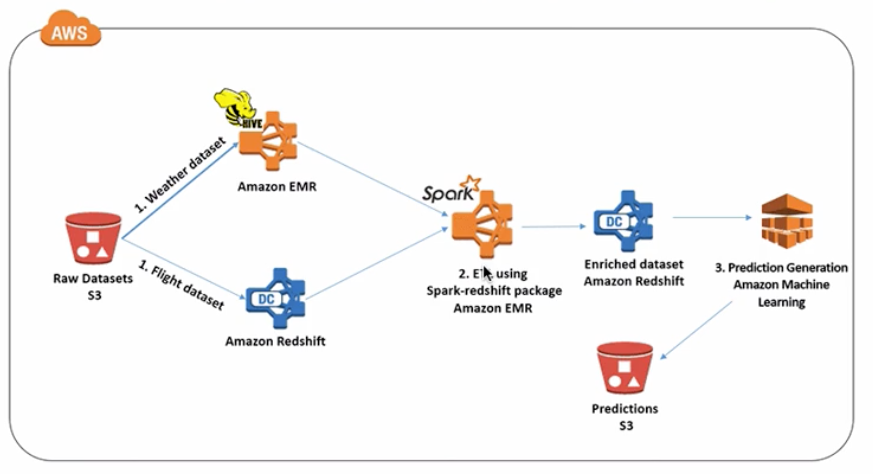

### Spark on EMR Part 2

* Spark processing engine deployed to each node in the cluster

* Spark framework replaces MapReduce framework

* Spark and SparkSQL can still interact w/ HDFS, but also S3

* Specifically, this lecture is on integration with Kinesis Streams, Redshift and DynamoDB

#### Kinesis Streams

* Spark streaming receives live input data streams, divides data into batches which are then processed by Spark engine to generate final stream of results (in batches)

* Spark streaming provides a high-level abstraction called **Discretized Streams** (or **DStreams**) which are a continuous stream of data

* DStreams can then be created from input data streams from sources like Kinesis Streams

* Internally, a DStream is a collection of RDDs

* Transformations can be applied to these RDDs

* Results can be published to HDFS, databases or dashboards

* You can have a KinesisProducer app developed using KinesisProducer library

* Kinesis stream is divided into shards, each one is a uniquely identified group of data records

* Spark Streaming uses KinesisClient Library to consume data from Kinesis Stream

* KinesisClient Library handles load balance, failure recovery and checkpointing

* KinesisClient Library provided to Apache by Amazon under the Amazon software license

**Process:**

* Kinesis Consumer app developed with KinesisClient Library instantiates a worker with configuration information

* Then uses a record processor to process data received from a shard in the Kinesis Stream

* The consumer app then creates an input DStream using KinesisClient Library

**References for Exam - AWS Big Data blog posts**

* [Querying Amazon Kinesis Streams Directly with SQL and Spark Streaming](https://aws.amazon.com/blogs/big-data/querying-amazon-kinesis-streams-directly-with-sql-and-spark-streaming/)

* [Optimize Spark-Streaming to Efficiently Process Amazon Kinesis Streams](https://aws.amazon.com/blogs/big-data/optimize-spark-streaming-to-efficiently-process-amazon-kinesis-streams/)

* [Analyze Realtime Data from Amazon Kinesis Streams Using Zeppelin and Spark Streaming](https://aws.amazon.com/blogs/big-data/analyze-realtime-data-from-amazon-kinesis-streams-using-zeppelin-and-spark-streaming/)

* [Analyze Your Data on Amazon DynamoDB with Apache Spark](https://aws.amazon.com/blogs/big-data/analyze-your-data-on-amazon-dynamodb-with-apache-spark/)

* [Powering Amazon Redshift Analytics with Apache Spark and Amazon Machine Learning](https://aws.amazon.com/blogs/big-data/powering-amazon-redshift-analytics-with-apache-spark-and-amazon-machine-learning/)

* [Using Spark SQL for ETL](https://aws.amazon.com/blogs/big-data/using-spark-sql-for-etl/)

#### Spark and Redshift

* Spark for ETL of large amounts of data

* Hive tables in HDFS or S3, text files (csv), parquet, etc.

* ETL in Spark gives performance benefit

* Can send data to Redshift for analysis

* Databricks Spark Redshift library

* [Redshift Data Source for Apache Spark](https://github.com/databricks/spark-redshift)

    * Reads data from Redshift, and can write back to Redshift by loading data into SparkSQL DataFrames

        * Spark Redshift library executes Redshift UNLOAD command to copy data to an S3 bucket

        * Files in s3 are then read

        * SparkSQL DataFrame is generated and registered as a temp table in Spark

        * Queries can then be executed directly against it

    * Spark-Redshift library can be used with various data in S3, Hive tables, text or Parquet files on HDFS

#### Spark and DynamoDB

* Use AWSLabs’s EMR DynamoDB Connector `emr-ddb-hadoop.jar` library used to let Spark interact with DynamoDB

* See sample code here: [emr-dynamodb-connector](https://github.com/awslabs/emr-dynamodb-connector)

#### For the exam, know

* How Spark Streaming and Kinesis Streams work together

    * Read and understand relevant blog posts (see above)

    * Have a high-level understanding of how Spark connects to / integrates with Redshift and DynamoDB

