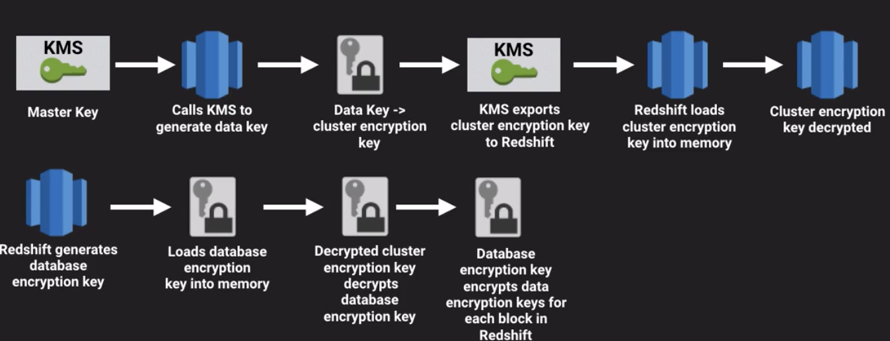
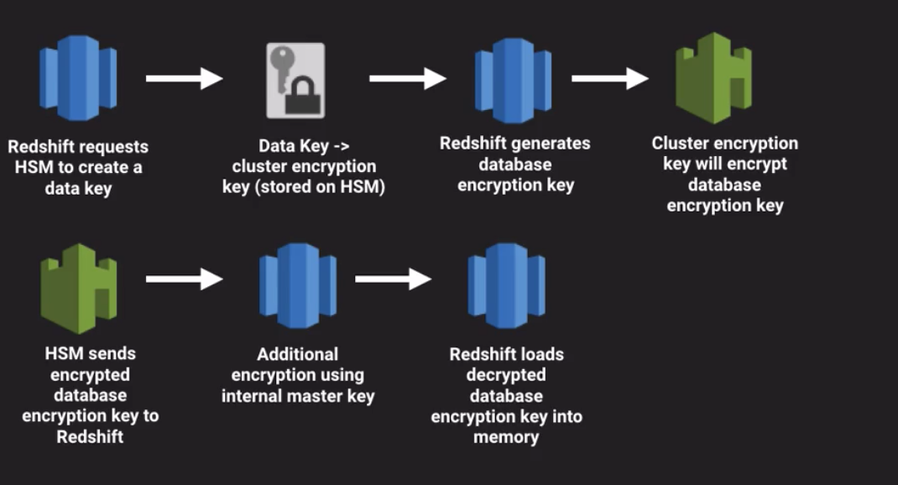

## Redshift Security

[Amazon Redshift Database Encryption](http://docs.aws.amazon.com/redshift/latest/mgmt/working-with-db-encryption.html)

### Encryption in-transit

* SSL support is solely for encrypting the connection between your client and the cluster
  * Redshift creates and installs a self-signed SSL Certificate on each cluster
  * To set up “layer 1”:
    * Create a **non-default Paramater Group** in Redshift
    * Change the require_ssl parameter to true 
    * (you can NOT make this change in the Default Parameter Group)
    * Associate this new Parameter Group with your Redshift cluster
* Note that you’ll need to connect using SSL through Aginity or SQL Workbench/J or whatever now
* “Layer 2” - use a certificate - guarantees cluster you’re connecting to is actually a RS cluster - instructions are on the [Configure Security Options for Connections](http://docs.aws.amazon.com/redshift/latest/mgmt/connecting-ssl-support.html) page
* This page has a link to the public key, can install that on client and use it to connect to Redshift cluster

### Encryption at-rest

* When you enable encryption at-rest, you’re encrypting
  * Data blocks
  * System metadata
  * Snapshots
* Encryption on RS cluster is immutable - can’t change the cluster back to unencrypted - would have to unload the data and reload into new, non-encrypted cluster

#### Key Management Service (KMS)

* Four-tier hierarchy of encryption keys:
  * **Master key** - As you launch a cluster and select KMS to encrypt your db, Redshift returns a list of Master keys
      * select from list - lists all of the following:
          * keys you’ve **created**
          * keys you have **access to**
          * **default** keys, e.g., customer master key for Redshift
              * **default** key is AWS-managed key, KMS creates this key first time you create an encrypted cluster
  * **Cluster encryption key** - After you select master key, Redshift requests that KMS create a data key and encrypt it with the Master key.  This key is then used as Cluster encryption key.  
      * KMS then exports Cluster encryption key to Redshift, stores it in internally on disk, separate network from cluster
      * RS then loads the Cluster encryption key into memory and calls KMS to decrypt this key and loads it into memory
  * **Database encryption key** - Redshift generates this key and loads it into memory
      * Decrypted cluster encryption key is used to decrypt Database encryption key
  * **Data encryption keys** - Decrypted database encryption key encrypts data encryption keys randomly generated for for each block in Redshift
  

#### Hardware Security Modules (HSMs)

* Physical devices that safeguard and manage digital keys for strong authentication and provide cryptoprocessing
* Contractual, regulatory requirements may determine if a HSM must be used instead of KMS
* For either on-prem or Cloud HSM, you have to setup a trusted connection (HSM Connection) b/t Redshift and the HSM

    * Used to pass encryption keys b/t the HSM and Redshift during encryption and decryption operations
 
* $5,000 to provision a Cloud HSM!!!

**To launch a cluster with HSM follow these steps:**
1. Obtain your HSMs public certificate.
1. Create an HSM Connection, providing the public certificate from Step 1.
1. Create an HSM Client Certificate and download the public key.
1. Upload the public key from Step 3 to your HSM
1. Launch a cluster and select the HSM Connection and HSM Client Certificate you created in the launch wizard.

For more information, see the [Redshift Documentation on Using HSM](https://docs.aws.amazon.com/redshift/latest/mgmt/welcome.html).

**How HSM and Redshift pass encryption keys**
1. When you select an HSM to manage encryption keys on cluster launch, RS sends request to the HSM to create and store a key
1. That key will be used as the Cluster encryption key, and will be stored on the HSM
1. RS then randomly generates the database encryption key in the cluster, and passes it to the HSM to be encrypted by the Cluster encryption key
1. HSM returns encrypted database encryption key to RS
1. RS performs additional encryption by using a randomly-generated internal master key that’s stored internally on disk in a separate network from the cluster
1. RS loads the decrypted version of the Database encryption key into memory in the cluster so that the Database encryption key can be used to encrypt and decrypt individual keys for the data blocks

| CloudHSM | KMS |
|----------|-----|
|$16K / year + $5K up-front |Usage-based pricing |
|Need to setup HA and durability |Highly available and durable |
|single-tenant | Multi-tenant |
| Customer managed root of trust | AWS managed root of trust |
| Internal Common Criteria EAL4+ and US Government NIST FIPS 140-2 | Auditing |
| Symmetric and Asymmetric encryption (public and private keys) | Symmetric encryption only (same keys used to perform encryption and decryption) |

**For the exam:**
* Understand how encryption in-transit works with Redshift
* Understand the options for managing encryption keys with Redshift
  * CloudHSM
  * KMS
* Know the differences b/t CloudHSM and KMS

